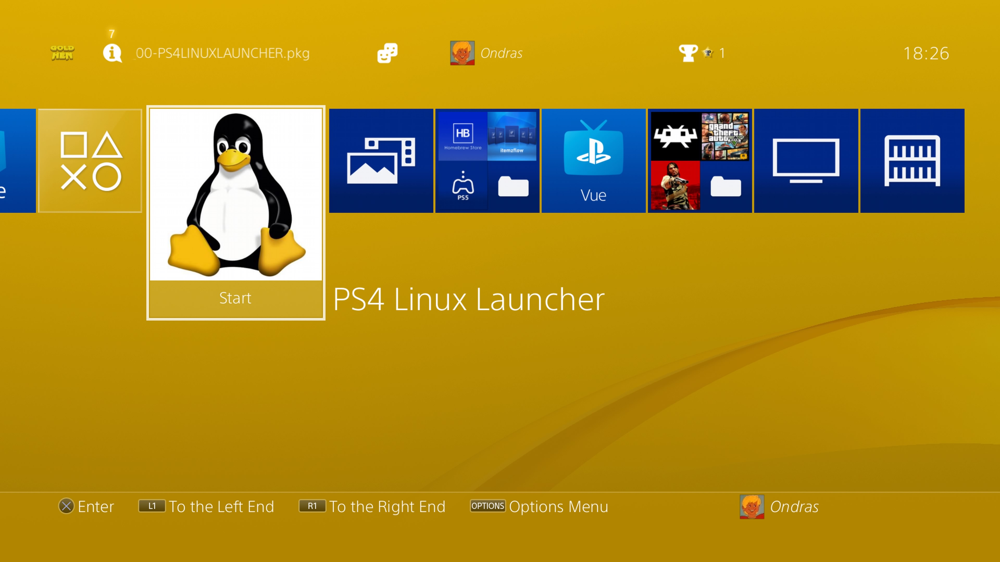

# PS4 Linux Launcher

A handy thing for personal use where i can launch PS4 Linux quickly without scrolling through Payload Guest.

## Payloads

At launch time the app searches for the following payloads, in order, and runs the first one it finds:

1. `linux-1gb.bin`
2. `linux.bin`

The search order for each name is:

1. `/data/payloads/` (the PS4's internal hard drive)
2. `/mnt/usb*/payloads/` (a USB device's `/payloads/` directory)

If no payload can be found an on-screen error is shown; press **Cross** to dismiss it.

Payloads are handed off to a running loader when one is available (Mira on port `9021`, GoldHEN on port `9090`) and otherwise executed directly.

## License

Please take notice of the [LICENSE](https://github.com/Al-Azif/ps4-payload-guest/blob/main/LICENSE). It's GPL-3, meaning if you modify this you MUST provide your source along with other requirements. You can find more info [here](https://tldrlegal.com/license/gnu-general-public-license-v3-(gpl-3)).

This project is a fork of [ps4-payload-guest](https://github.com/Al-Azif/ps4-payload-guest) by Al-Azif; the original UI base is by TheoryWrong.

## Screenshot

